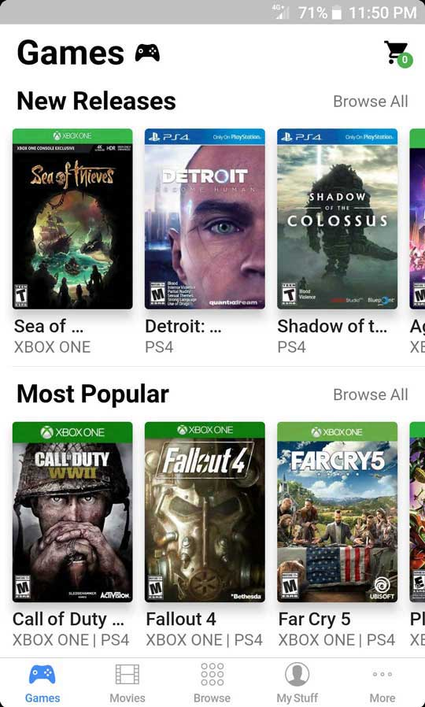
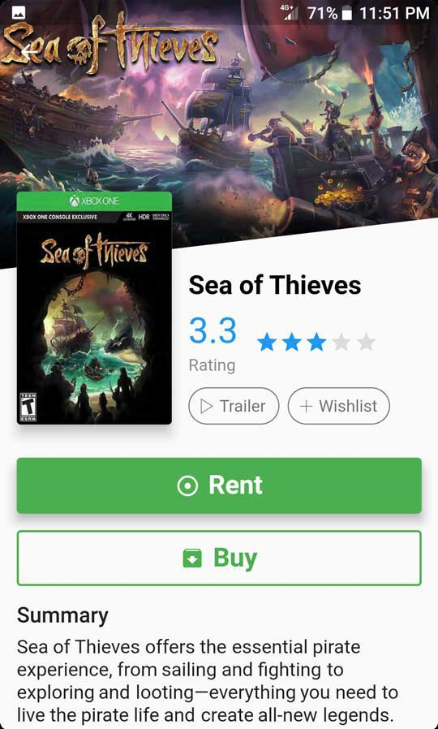
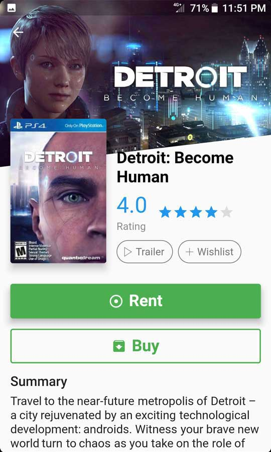

    
# Flutter Games

Flutter Games is an app for purchasing and renting games. This demo app is my first adventure in Flutter and I have to say its been a blast!

If you like this app, you might like some of my other repos too! [View More](http://rayliverified.com/index.php/code/)

# Screenshots

# Flutter is Amazing

A quick list of what I found makes Flutter great:

* **Views are code.** Much less boilerplate than having adapters, viewholders, and XML all over the place.
* **Hero shared element transitions.** Just wrap shared elements in a Hero widget and give them the same tag to created a shared transition. No need to read 3 pages of documentation and write tightly coupled code :) This is truly mindblowing. 
* **Graceful image loading.** Flutter understands that visible images should be loaded first. The way Flutter does image loading in a List is just so beautiful!
* **Highly customizable button content positioning.** On Android, Buttons aren't very well designed. 'drawableLeft' and 'drawableRight' have very awkward and difficult to customize positioning. Flutter gives you full control over the positioning of items in your button.
* **Minimal dependencies.** Flutter comes with so much out of the box. This entire app was built without any external dependencies! (cupertino icons doesn't count :P)

# Flutter Wishlist

Flutter is very new so there are some features and libraries missing that would make development much better. Here are some of those missing components I would have liked to use:

---

>Image Gallery ✔️

Something to view images with. Android doesn't have a good image viewing library either (sigh).

**UPDATE:** https://github.com/tinylife-io/flutter_scroll_gallery

>Change Button's Inner Contents on Press

There's no way to set text/icon color when a button is pressed. This lack of functionality really limits the range of buttons one can create.

>Video Player ✔️

Something to play trailer videos or just videos in general.

**UPDATE:** https://github.com/brianegan/chewie

---

If any of the above now exists, please let me know.

Pull requests are most welcome!

If you've fixed a bug or have a feature you've added, just create a pull request. If you've found a bug, file an issue. If you have any questions or would like to discuss upcoming features, please get in touch. You can get in touch with me in the Contact section below. 

# ★ Acknowledgements ★
**♥ Developer ♥**

[Ray Li](https://rayliverified.com)

**♥ Designer ♥**

[Ray Li](https://rayliverified.com)

**♥ Inspiration ♥**

[FlutterCinematic](https://github.com/aaronoe/FlutterCinematic)

[FlutterPlantly](https://github.com/Ivaskuu/plantly)

[FlutterMovieDetailsUI](https://github.com/FlutterRocks/movie-details-ui)

[FlutterMates](https://github.com/CodemateLtd/FlutterMates)

# ★ Get in Touch ★

#### Search Terms
flutter, game, movie, demo, sample, rent, buy, shop

## Getting Started

For help getting started with Flutter, view our online
[documentation](https://flutter.io/).
